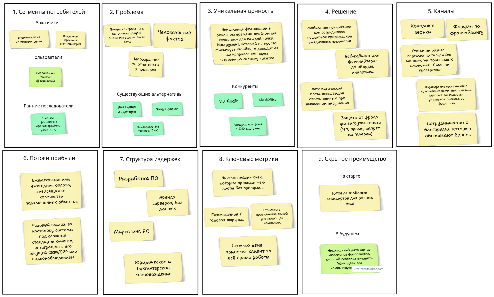
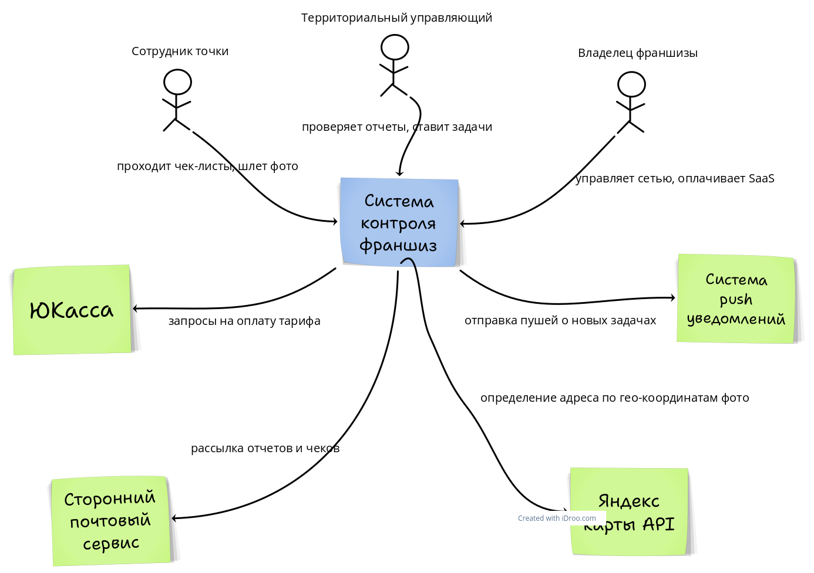
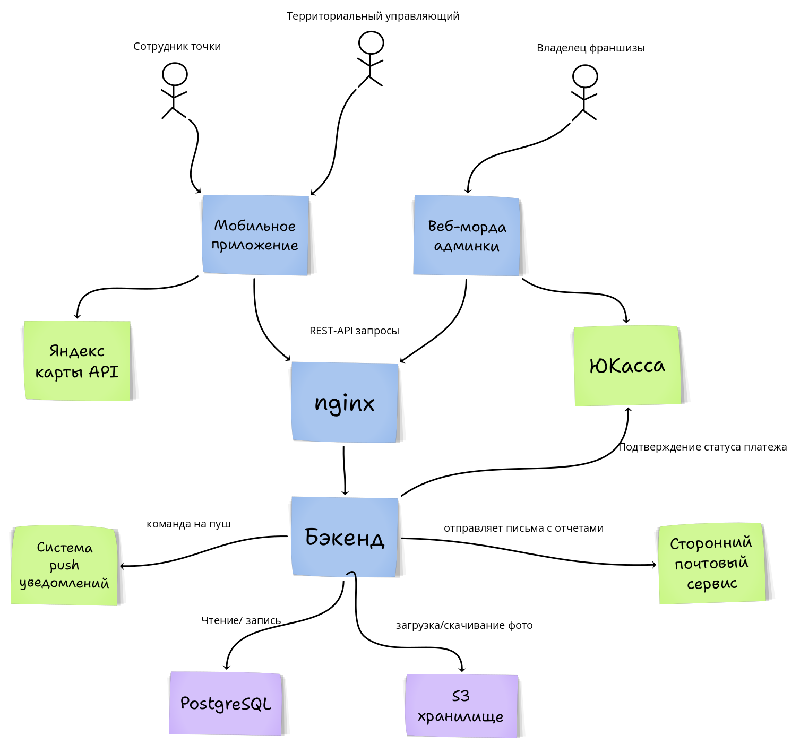

# Тема: Управление бизнесом: SaaS для контроля стандартов во франшиза

## Практическое задание №1

## Краткое описание
Мы создаем B2B SaaS-платформу, которая помогает франчайзерам автоматизировать контроль соблюдения корпоративных стандартов на всех точках сети. Система переводит бумажные проверки и переписки в мессенджерах в удобные мобильные чек-листы с автоматизированной аналитикой и (опционально) AI-проверкой фотоотчетов. Это позволяет владельцам бизнеса видеть реальную картину происходящего на местах в режиме реального времени, моментально реагировать на нарушения и гарантировать единый уровень качества без раздувания штата аудиторов.

## Elevator Pitch
Управляющие компании франшиз теряют лояльность клиентов и прибыль из-за того, что удаленные точки не соблюдают единые стандарты качества. Сейчас контроль превращается в хаос: отчеты собираются вручную в Excel, фото скидываются в мессенджеры, а выездные проверки стоят дорого и не дают картины в реальном времени. 
Мы создаем единую SaaS-систему для управления стандартами франшиз. В отличие от универсальных таск-трекеров, наша платформа предлагает специализированные чек-листы с защитой от подделки фото (снимки делаются только внутри приложения) и автоматической генерацией задач на устранение нарушений. В результате франчайзер в один клик видит «индекс здоровья» каждой точки на дашборде, сокращает затраты на физические аудиты и обеспечивает 100% соблюдение стандартов бренда по всей сети, а франчайзи получают понятный инструмент для улучшения своей работы.

### Lean Canvas



## Практическое задание №2

### Определение ролей и User Stories

**РОЛИ:**
1. **Сотрудник точки (Франчайзи)** - линейный персонал, который находится на локации и выполняет стандарты.
2. **Аудитор / Терр. управляющий** - проверяет выполнение стандартов, инициирует исправления.
3. **Франчайзер (Владелец / Руководитель сети)** - следит за общей картиной, принимает стратегические решения.
4. **Администратор** - управляет доступами, точками и подпиской.

### Приоритезация функционала (MoSCoW)

**MoSCoW приоритезация:** 
✅ **MUST** (обязательно - без этого продукт не имеет смысла) 
🟢 **SHOULD** (важно, нужно сделать в ближайших релизах) 
🟡 **COULD** (желательно, улучшает UX, вау-эффект) 
❌ **WON’T** (не делаем сейчас, за рамками текущего фокуса)

**USER STORIES:**

**Сотрудник точки (Франчайзи)**
- Получить список назначенных чек-листов на смену - ✅ Must
- Заполнить пункты чек-листа с мобильного телефона - ✅ Must
- Сделать фото нарушения/выполнения через камеру (без загрузки из галереи) - ✅ Must
- Отправить заполненный чек-лист на проверку - ✅ Must
- Получить задачу на устранение выявленного нарушения - 🟢 Should
- Отметить нарушение как исправленное  - 🟢 Should
- Посмотреть рейтинг своей точки среди остальных - 🟡 Could
    

**Аудитор / Территориальный управляющий**

- Просмотреть список всех отправленных отчетов по своим точкам - ✅ Must
- Принять или отклонить выполнение конкретного пункта чек-листа - ✅ Must
- Оставить текстовый комментарий к проблемному пункту - ✅ Must
- Создать тикет на исправление нарушения для франчайзи - 🟢 Should
- Получить пуш-уведомление о критическом нарушении (например, точка не открылась вовремя) - 🟢 Should
- Посмотреть историю всех проверок конкретной точки за месяц - 🟡 Could

**Франчайзер (Владелец)**
- Видеть сводный рейтинг соблюдения стандартов по всей сети - ✅ Must
- Создавать и редактировать шаблоны чек-листов (добавлять/удалять пункты) - ✅ Must
- Видеть топ худших и топ лучших точек сети - 🟢 Should
- Выгружать детальные отчеты в PDF/Excel для совещаний - 🟢 Should
- Анализировать фотоотчеты с помощью AI (автоматический поиск нарушений на фото) - ❌ Won’t

**Администратор**
- Добавить новую точку франшизы в систему - ✅ Must
- Добавить сотрудников и назначить им роли - ✅ Must
- Оплатить подписку (SaaS) / продлить лицензию - ✅ Must
- Интегрировать систему с корпоративной ERP (например, 1C) - ❌ Won’t

---

### Формирование MVP и MLP

**MVP**
- **Админ:** Добавить точку, добавить сотрудника, оплатить сервис.
- **Франчайзер:** Создать базовый шаблон чек-листа; Видеть простой дашборд со статусами отчетов (сдан/не сдан).
- **Сотрудник:** Открыть чек-лист, отметить пункты (да/нет), сделать фото строго с камеры, отправить отчет.
- **Аудитор:** Открыть присланный отчет, посмотреть фото, принять или отклонить отчет целиком.

**MLP (Фичи, которые дают контроль, удобство и решают боль коммуникации)**
- Защита от фрода (геометка и таймстемп на фото).
- Система тикетов (создание задач на исправление конкретных ошибок внутри приложения, а не в мессенджерах).
- Детальный дашборд с рейтингом точек (топ лучших / худших).
- Пуш-уведомления о критических ошибках.
- Возможность работать с приложением оффлайн (на складах или в подвалах часто нет сети).

---

### Детализация требований (ФТ и НФТ)

2 критически важные истории из MVP

#### 1) Заполнение чек-листа и фотофиксация (Роль: Сотрудник точки)

**ФТ (Функциональные требования)**
- Система отображает список пунктов активного чек-листа (текст + чекбоксы "Да/Нет/Н/А").
- Система по тапу на иконку камеры открывает системный интерфейс съемки.
- Система **блокирует** возможность выбрать фото из галереи устройства (только Live-фото).
- Система накладывает на сделанную фотографию водяной знак с текущей геопозицией (GPS) и временем.
- Система блокирует кнопку «Отправить отчет», если не заполнены все обязательные поля или не прикреплены обязательные фото.
- Система сохраняет прогресс заполнения локально, если приложение было свернуто.
    

**НФТ (Нефункциональные требования)**
- Открытие камеры происходит ≤ 1 сек.
- Система сжимает фотографии до размера не более 1 МБ без критической потери качества
- Интерфейс корректно отображается и не лагает на бюджетных смартфонах
- Кэширование данных: при потере сети система позволяет сделать фото и заполнить чек-лист в оффлайн-режиме, а при появлении сети - моментально отправляет данные на бэкенд.
    

#### 2) Сводный дашборд сети (Франчайзер)

**ФТ (Функциональные требования)**
- Система собирает данные со всех отправленных чек-листов и рассчитывает общий "Индекс качества" сети в процентах (%).
- Система выводит на главный экран виджеты: «Всего точек», «Проверено сегодня», «Найдено критических нарушений».
- Система отображает список точек с цветовой индикацией (зеленый - все ок, желтый - есть мелкие нарушения, красный - критические нарушения).
- Система позволяет по клику на конкретную точку открыть детальный список ее отчетов.
- Система фильтрует дашборд по датам (сегодня, неделя, месяц) и регионам.
    

**НФТ (Нефункциональные требования)**

- Загрузка дашборда и отрисовка графиков занимает ≤ 1 сек
    
- Веб-интерфейс дашборда адаптивен
    
- Система выдерживает масштабирование до 2 000 подключенных точек без деградации производительности.
    
- Данные разных компаний изолированы друг от друга на уровне БД

## Практическое задание №3

### DDD: Доменные зоны и глоссарий

Разделим систему на 4 ключевые доменные зоны.

**1. Домен: Управление проверками**

- **Краткое описание:** Эта зона отвечает за создание эталонных стандартов и процессы заполнения отчетов линейным персоналом на точках.
    
- **Что входит:**
    
    - создание и редактирование шаблонов чек-листов
        
    - назначение проверок на конкретные точки по расписанию
        
    - процесс прохождения чек-листа (ответы на вопросы, прикрепление фото)
        
    - отправка готового отчета
        
- **Глоссарий:**
    
    - ChecklistTemplate - Шаблон чек-листа (набор критериев)
        
    - Criterion - Критерий проверки (пункт чек-листа)
        
    - Inspection (Report) - Конкретная сессия проверки (отчет)
        
    - Answer - Ответ на критерий (Да/Нет/Н-А)
        

**2. Домен: Управление нарушениями (Issue Tracking)**

- **Краткое описание:** Зона отвечает за жизненный цикл выявленных проблем. Если пункт чек-листа не выполнен, генерируется задача на устранение.
    
- **Что входит:**
    
    - автоматическое создание тикета при негативном ответе в отчете
        
    - назначение ответственного за исправление
        
    - смена статусов тикета (Открыт, В работе, Решён)
        
    - прикрепление фото-подтверждения исправления
        
- **Глоссарий:**
    
    - Issue (Ticket) - Нарушение (задача на исправление)
        
    - IssueStatus - Текущее состояние проблемы (Open, Resolved, Closed)
        
    - Assignee - Ответственный за устранение нарушения
        
    - Resolution - Результат исправления (комментарий + фото)
        

**3. Домен: Организация и структура (Organization and Access)**

- **Краткое описание:** Зона управления иерархией франшизы, пользователями и их правами.
    
- **Что входит:**
    
    - создание структуры компании (Регион, Город, Точка)
        
    - управление профилями сотрудников
        
    - выдача ролей (Владелец, Аудитор, Франчайзи)
        
    - управление подпиской (SaaS-лицензия)
        
- **Глоссарий:**
    
    - Tenant - Управляющая компания (клиент B2B)
        
    - Branch (Location) - Конкретная точка франшизы
        
    - User - Пользователь системы
        
    - Role - Набор прав доступа
        
    - Subscription - Активный тарифный план
        

**4. Домен: Аналитика (Analytics & Monitoring)**

- **Краткое описание:** Зона агрегации данных для предоставления визуальных отчетов и дашбордов руководству.
    
- **Что входит:**
    
    - расчет рейтинга compliance (соблюдения стандартов) для каждой точки
        
    - формирование топов (лучшие/худшие франчайзи)
        
    - сбор статистики по самым частым нарушениям
        
- **Глоссарий:**
    
    - ComplianceScore - Индекс соблюдения стандартов (в процентах)
        
    - Dashboard - Сводная панель показателей
        
    - Metric - Вычисляемый показатель (например, % вовремя сданных отчетов)
        

---

### BDD: Критический путь MVP (Поведенческая разработка)

Пользователь открывает приложение -> Выбирает активный чек-лист -> Отвечает на вопросы и делает фото -> Отправляет отчет

**Сценарий успеха** 
**Дано**

- сотрудник авторизован в мобильном приложении
    
- у сотрудника есть назначенный чек-лист на текущую смену
    
- устройство имеет доступ к камере и геолокации 
**Когда**
    
- сотрудник открывает чек-лист
    
- отмечает все обязательные пункты
    
- нажимает "Сделать фото" в требуемых пунктах и успешно делает снимок через камеру
    
- нажимает кнопку "Отправить отчет" 
**Тогда**
    
- система проверяет заполненность всех полей
    
- система сохраняет отчет в базе данных
    
- система меняет статус чек-листа на "Выполнен"
    
- пользователь видит экран успешной отправки
    
- аудитор получает уведомление о новом отчете
    

**Сценарий отказа (Неполные данные)** 
**Дано**

- сотрудник авторизован в мобильном приложении
    
- сотрудник заполняет активный чек-лист 
**Когда**
    
- сотрудник пропускает обязательный пункт с фотофиксацией (например, "Фото чистой кассовой зоны")
    
- нажимает кнопку "Отправить отчет" 
**Тогда**
    
- система блокирует отправку отчета
    
- система подсвечивает пропущенный пункт красным цветом
    
- система показывает всплывающее сообщение "Заполните все обязательные поля и прикрепите фото"
    
- статус чек-листа остается "В процессе"

### Wireframes: ключевые экраны критического пути MVP

Для критического пути "Открыть чек-лист -> заполнить пункты -> сделать фото -> отправить отчет" добавлены 4 основных экрана:

1. Список назначенных проверок (выбор активного чек-листа).
![[Pasted image 20260506160236.png]]
2. Экран заполнения чек-листа (Да/Нет/Н/А, прогресс).
![[Pasted image 20260506160250.png]]
3. Фотофиксация нарушения (камера внутри приложения).
![[Pasted image 20260506160300.png]]
4. Подтверждение отправки отчета и статус проверки.
![[Pasted image 20260506160309.png]]

### API-First: JSON-контракты

Спроектируем 2 главные ручки для работы с отчетами. (фото загружаются отдельным методом, который возвращает массив `photo_ids`, чтобы не перегружать основной JSON).

**1. Получить детали назначенного чек-листа** `Endpoint: GET /api/v1/inspections/pending?branch_id=456`

**Response 200 (Успех)**

JSON

```
{
  "inspection_id": "a1b2c3d4",
  "status": "pending",
  "template_name": "Утреннее открытие кофейни",
  "deadline": "2026-05-05T10:00:00Z",
  "criteria": [
    {
      "criterion_id": 101,
      "text": "Пол в клиентской зоне чистый?",
      "is_photo_required": false
    },
    {
      "criterion_id": 102,
      "text": "Витрина с десертами заполнена по планограмме?",
      "is_photo_required": true
    }
  ]
}
```

**2. Отправить заполненный отчет** `Endpoint: POST /api/v1/inspections/a1b2c3d4/submit`

**Request**

JSON

```
{
  "worker_id": 789,
  "completed_at": "2026-05-05T09:45:12Z",
  "answers": [
    {
      "criterion_id": 101,
      "value": "yes",
      "photo_ids": []
    },
    {
      "criterion_id": 102,
      "value": "no",
      "comment": "Нет шоколадных маффинов на складе",
      "photo_ids": ["img_99823", "img_99824"]
    }
  ]
}
```

**Response 200 (Успех)**

JSON

```
{
  "inspection_id": "a1b2c3d4",
  "status": "completed",
  "score": 50.0,
  "issues_created": 1,
  "message": "Отчет успешно сохранен"
}
```

**Response 400 (Ошибка валидации - забыли фото)**

JSON

```
{
  "error_code": "VALIDATION_ERROR",
  "message": "Не пройдены обязательные условия чек-листа",
  "details": [
    {
      "criterion_id": 102,
      "error": "photo_required",
      "description": "К этому пункту обязательно нужно прикрепить фотографию"
    }
  ]
}
```

## Практическое задание №4

### Схема C4: Контекст и контейнеры

## C4

### Level 1



### Level 2



### Выбор и обоснование стека

**Стек технологий**

**Frontend**

- React - разработка веб-кабинета франчайзера со сводными дашбордами и конструктором чек-листов.
    
- Flutter - создание кроссплатформенного мобильного приложения для сотрудников, чтобы охватить сразу iOS и Android единой кодовой базой.
    

**Backend**

- Python (Django, Django REST Framework) - ядро бизнес-логики и REST API. Позволяет быстро реализовать сложную систему доступов и ролей, опираясь на встроенную ORM.
    
- Go - для выноса критических узлов в высоконагруженные сервисы при масштабировании (например, конвейер обработки и сжатия тысяч фотографий в минуту).
    

**База данных**

- PostgreSQL - основная реляционная СУБД. Идеально подходит для связывания сложной иерархии: сеть, регион, точка, сотрудник, отчет.
    

**Инфраструктура**

- Nginx - обратный прокси-сервер и точка входа для всех запросов.
    
- Gunicorn - WSGI-сервер для надежной работы Python-приложения в связке с Nginx.
    
- Redis - быстрый кэш для дашбордов и брокер очередей для фоновых задач.
    
- S3 (MinIO / AWS S3) - объектное хранилище для медиафайлов, так как фотоотчеты нельзя хранить напрямую в БД.
    

**Внешние сервисы**

- Яндекс.Карты API - сервис геокодинга для верификации координат сотрудника в момент создания фотоотчета.
    
- ЮKassa API - автоматизация биллинга и списания регулярных платежей за SaaS-подписку.
    
- Firebase Cloud Messaging (FCM) / APNs - диспетчер push-уведомлений для информирования о новых задачах и тикетах.

## Практическое задание №5

### Hiring Plan

**Hiring plan**

**Кросс-функциональная команда**

- **Tech Lead** - проектирование SaaS-архитектуры, выбор инфраструктурных решений, код-ревью и контроль безопасности (изоляция данных разных франшиз).
    
- **Backend Developer** - проектирование сложной схемы БД (сети, точки, сотрудники), разработка REST API, интеграция с S3-хранилищем для медиафайлов.
    
- **Mobile Developer (Flutter / React Native)** - создание кроссплатформенного приложения, реализация камеры с защитой от фрода (запрет загрузки из галереи, водяные знаки).
    
- **Frontend Developer** - разработка веб-кабинета (SPA) для управляющей компании, создание дашбордов и конструктора чек-листов.
    
- **Product Manager** - CustDev с владельцами франшиз, декомпозиция фич на задачи, управление бэклогом и написание критериев приемки.
    
- **UI/UX Designer** - проектирование удобных интерфейсов: максимально простого для линейного персонала (мобилка) и аналитического для менеджмента (веб).
    

**Увеличение команды в будущем**

- **QA Engineer** - автоматизация тестирования, ручная проверка работы мобильного приложения на старых и бюджетных смартфонах.
    
- **Data Scientist / ML Engineer** - разработка моделей компьютерного зрения для автоматического анализа фотоотчетов.
    

### Development Framework

**Development framework**

Будем использовать Scrum. Это подходит для нашего проекта, потому что в B2B-сегменте клиентам критически важна предсказуемость сроков поставки нового функционала. Двухнедельные спринты позволяют нам давать четкие обещания по релизу новых фич. Также это дает возможность регулярно показывать готовый инкремент на демо первым тестовым клиентам и сразу корректировать курс продукта на основе их обратной связи, не уходя в долгую разработку ненужных функций.

### Team Rituals

**Team rituals**

- **Планирование спринта** - выбрать приоритетные задачи на ближайшие 2 недели, оценить их и зафиксировать цель спринта (1 раз в 2 недели).
    
- **Дейлики** - быстро синхронизироваться: что сделал, что буду делать, какие есть проблемы/блокеры (каждый день).
    
- **Демо (Review)** - показать работающий функционал (новые фичи веб-кабинета или приложения) стейкхолдерам и собрать фидбек (в конце спринта).
    
- **Ретроспектива** - обсудить работу команды в текущем спринте и предложить улучшения процессов в следующем (в конце спринта, после демо).
    
- **Груминг бэклога (Refinement)** - актуализация бэклога, проработка требований для будущих задач, чтобы сэкономить время на планировании (1 раз в неделю).

## Практическое задание №6

### Выявление ключевых рисков и стратегия реагирования

**Управление рисками**

| Риск                                     | Тип        | Вероятность | Влияние | Стратегия     | Действие                                                                                                                                         |
| ---------------------------------------- | ---------- | ----------- | ------- | ------------- | ------------------------------------------------------------------------------------------------------------------------------------------------ |
| Саботаж системы линейным персоналом      | Внешний    | 3           | 3       | Смягчить      | Жесткая защита от фрода в приложении (только Live-фото), обязательный онбординг, где объясняется, что система помогает им, а не только штрафует. |
| Отказ работы в ТЦ и подвалах (нет сети)  | Внешний    | 3           | 2       | Предотвратить | Реализация надежного оффлайн-режима: сохранение отчетов и фото в кэш телефона с автоматической доотправкой при появлении интернета.              |
| Раздувание расходов на S3-хранилище      | Внутренний | 3           | 2       | Смягчить      | Внедрить алгоритмы сжатия фотографий на клиенте перед отправкой + настроить автоудаление (TTL) отчетов старше 3 месяцев для базовых тарифов.     |
| Долгий цикл B2B-продаж SaaS              | Внешний    | 2           | 3       | Смягчить      | Предлагать управляющим компаниям бесплатный пилотный запуск на 1-2 тестовых точках, чтобы быстро показать ценность продукта.                     |
| Тормоза на старых смартфонах сотрудников | Внутренний | 2           | 3       | Предотвратить | Оптимизировать работу камеры в коде, избегать тяжелых анимаций, проводить регулярное ручное тестирование на бюджетных Android-устройствах.       |
